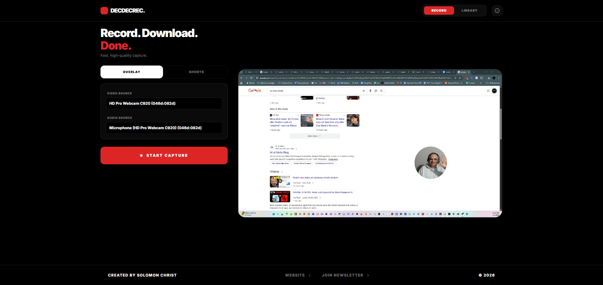
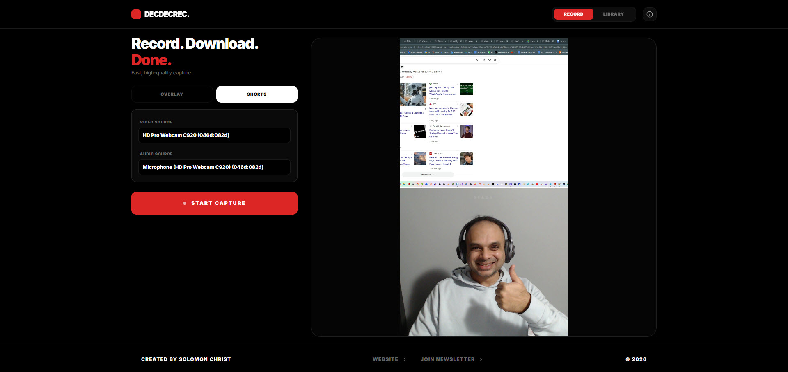

# DecDecRec - An OFFLINE / VPS Screen Recorder + Transcriber

**DecDecRec** is an open-source, minimalist, local-first utility for high-quality screen capture and webcam overlays. Designed for content creators building tutorials or shorts.

How did I come up with the name? It was December and I wanted to put December Recording tool and wanted it to be a unique name so I was like DecDecRec HAHAHAHA ;) 

**NOTE:** This was a Vibe Coded project using Google Gemini and ChatGPT for Prompting by **Solomon Christ** and updates are the responsibility of community contributors.

---

## 📸 Demo & Screenshots

## Vision
To provide a private, high-performance recording environment that respects user data. By leveraging local-first technologies like IndexedDB, WebAudio, and WebAssembly (FFmpeg), we eliminate the need for cloud uploads for processing, giving you full control over your media.

## Feature List
- **Local-First Recording**: Everything stays in your browser. No cloud uploads.
- **Smart Layouts**: 
  - **Circle Overlay**: Draggable circular webcam over your screen.
  - **9:16 Shorts**: Vertical layout with screen on top and webcam on bottom.
- **System + Mic Audio**: Mixed locally using WebAudio API.
- **High Quality**: Supports 720p/1080p at 30/60fps.
- **Library Management**: Persistent local storage using IndexedDB.
- **Full ZIP Export**: Download a timestamped bundle containing video, audio, transcript, and metadata.

## Tech Stack
- **React 18** (TypeScript)
- **Tailwind CSS** (Minimalist B&W UI)
- **FFmpeg.wasm** (Client-side video processing)
- **JSZip** (Bundled exports)
- **IndexedDB** (Local storage)
- **WebAudio API** (Audio mixing)

## Quick Start
NOTE: You need to have node.js installed on your system, download and then do an npm install for this app.

Then run using "npm run dev" and open in localhost and follow the instructions:

1. Open the application in a modern desktop browser (Chrome/Edge/Brave).
2. Allow Camera, Microphone, and Screen Capture permissions when prompted.
3. Select Layout (Overlay for floating webcam or Shorts for social.)
4. Select Sources (Select your camera and microphone).
5. Hit **Start Capture** (Local processing, zero cloud latency.).
6. Stop, Preview, and Export as a ZIP (WebM or production ZIP bundles).

## Offline Whisper Setup

### A) CLI Guide (Windows)
1. Install Python 3.11+. Ensure "Add Python to PATH" is checked.
2. Install FFmpeg (If you want to be able to edit the Webm Videos After): `choco install ffmpeg` or download binaries and add to PATH.
  2a. NOTE: Use the following command to convert a video from webm to mp4 using ffmpeg: `ffmpeg -i "INPUT.webm" -c:v libx264 -preset veryfast -crf 22 -c:a aac -b:a 192k -movflags +faststart "OUTPUT.mp4"`
3. For OFFLINE AI Audio Transcription Install OpenAI Whisper: `pip install -U openai-whisper`
4. Run (After you separate the audio from the file - try it with the mp4, should work): `whisper "audio.mp3" --model medium --output_format txt,srt`

## Additional Notes from Eric Knaus (https://www.linkedin.com/in/ericknaus/) Thanks Eric!
Also my install procedure was a bit different but I logged it for you:
* I had to navigate to DecDecRec > DecDecRec-Tool, and run `npm init --yes` to reconstruct the package.json file.
* Then I ran `npm i` to connect the package.json to npm.
* Then I could run `npm run dev`.
* I have something else running on port 3000 so this ran on the next available port above 3000.

## License
MIT License. Copyright (c) 2025 Solomon Christ (www.solomonchrist.com).

---
**Created by Solomon Christ**
[Solomon Christ Website](https://www.solomonchrist.com) | [AI Brief Substack](https://solomonchristai.substack.com/)
